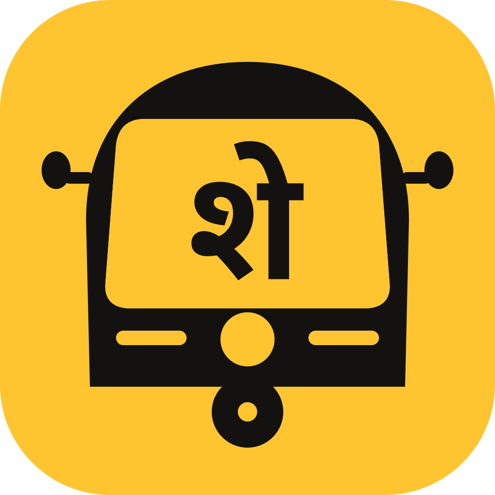

<div align="center">



# Sharing

**Rickshaw pooling for India.**
Three people, one rickshaw, one fixed fare each — and a seat you can count on tomorrow morning.

</div>

---

## The problem

Getting from Palava to Dombivli East station costs ₹150 alone, because the stand
won't run a shared rickshaw. Getting one at all means twenty minutes in a queue
after an hour on a train. And the driver who promises to pick you up at 10:30
daily has no reason to actually turn up — nor do you.

Those look like one problem. They are four, and the last one causes the first
three: **a driver who waits to fill three seats and fails has lost the trip.**
Any product that tries to fix rickshaw pooling by scolding drivers will fail.

**Sharing removes the driver's downside risk.** He is paid in full for every trip
that runs, from someone — a passenger, a replacement rider, or a guarantee fund
that every rider pays into. Once his income is safe, pooling becomes possible,
and a ₹150 ride becomes ₹56.

Full reasoning: [`docs/00-product-spec.md`](docs/00-product-spec.md)

---

## Three ways to ride

| | | |
|---|---|---|
| **Now** | You're at the stand | Join a pool that's forming, leave in minutes |
| **Later** | You're on a train | Post your arrival time, get matched before you land |
| **Daily** | You commute | Lock the same seat, same time, for a week or a month |

Every pool is exactly **three passengers**. Never four — it's the legal seating
capacity and the safety floor, and it's enforced by a database constraint rather
than a policy document.

---

## The hard part: what happens when someone falls ill

This is the question the whole product turns on. If you refund the passenger, the
driver — who woke at 6am and drove to the gate — loses money he counted on. If
you don't, the passenger feels robbed and tells four neighbours.

**We never ask why.** Not once, anywhere. A reason-based system can't be
verified, taxes the honest, and makes you the judge of other people's fevers.
Instead:

1. **Grace Days** — a visible budget of no-questions cancellations (1/week, 4/month)
2. **Reseat first** — your seat is offered to someone else before a grace day is spent
3. **Notice ladder** — beyond that, credit scales with how much warning you gave,
   because notice is exactly what determines whether we can resell the seat
4. **Guarantee Fund** — a 4% levy pays the driver when nobody else can

> **The driver is paid the full seat fare on every single path.** There is no
> branch where he eats the loss. That invariant is asserted across every
> combination of notice, grace and reseat outcome in the test suite.

Worked examples, exact numbers, and the solvency model:
[`docs/01-fairness-engine.md`](docs/01-fairness-engine.md)

---

## What's in here

```
docs/              The thinking. Start with 00, then 01.
packages/core/     Pricing, fairness, matching, fuel guardrails.
                   Pure TypeScript, no platform deps, 100 tests.
apps/mobile/       Expo (React Native) app for iOS and Android.
supabase/          Postgres schema, row-level security, edge functions.
brand/             Icon generator. Real vector glyphs in 5 Indian scripts.
```

| Doc | |
|---|---|
| [00 · Product spec](docs/00-product-spec.md) | The whole product, and what it deliberately isn't |
| [01 · Fairness engine](docs/01-fairness-engine.md) | Cancellations, grace days, credits, the fund |
| [02 · Matching](docs/02-matching-and-pools.md) | Pool lifecycle, the density switch, reseat market |
| [03 · Pricing](docs/03-pricing.md) | Fares, passes, short-fill |
| [04 · Fuel data](docs/04-fuel-data-program.md) | Driver fuel logging and its guardrails |
| [05 · Safety](docs/05-safety-and-trust.md) | Boarding, verification, the stand cartel |
| [06 · Brand](docs/06-brand-and-design-system.md) | Kaali-peeli, the regional icon, the 55-year-old test |
| [07 · Architecture](docs/07-tech-architecture.md) | Stack choices and why |
| [**08 · Launch playbook**](docs/08-launch-playbook.md) | **Zero-coding-knowledge path to both app stores** |
| [09 · Compliance](docs/09-compliance-india.md) | MVAG 2025, RBI e-mandate, DPDP |
| [10 · Roadmap & costs](docs/10-roadmap-and-costs.md) | Real rupees, 12 months |

---

## Run it

```bash
npm install
npm run verify     # typecheck both packages + 110 tests
npm run mobile     # scan the QR with Expo Go
```

The app runs on demo data for the real Palava ↔ Dombivli corridor, so you can
show it to a driver or a neighbour today with no backend at all.

Regenerate brand assets after changing the logo:

```bash
python3 brand/scripts/build-icons.py    # SVGs, all 5 scripts
node brand/scripts/build-png.mjs        # store-ready PNGs
```

---

## Before you spend money

Two things in the docs matter more than any code here:

1. **Run the paper pilot first.** Two weeks, one WhatsApp group, a notebook, ₹0.
   It answers the only question that matters — *will people actually pool?* —
   and no amount of software can answer it for you.
   ([playbook §0](docs/08-launch-playbook.md#0-do-this-before-you-spend-a-single-rupee-on-software))

2. **This app is an "aggregator" under the Motor Vehicles Act.** A state licence
   costs **₹5,00,000**. There is a legitimate staged path that defers it —
   start at V0, where the platform handles no money and needs no licence.
   ([compliance §2](docs/09-compliance-india.md#2-the-staged-path--start-where-you-can-afford-to))

---

## The metric

**Weekly Committed Retention** — of the passengers holding a pass in week *N*,
how many hold one in week *N+1*.

Below 50%, the product isn't working; don't spend on growth. Above 65%, it's a
real business. Every other number is a distraction at this stage.
